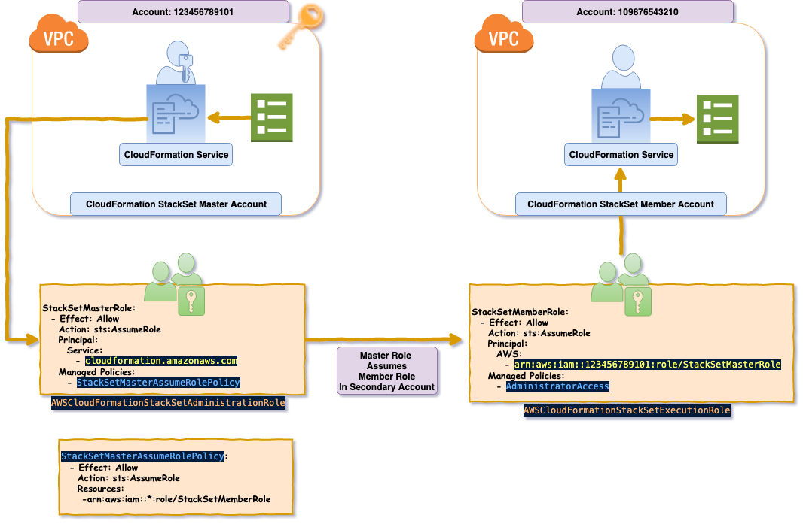
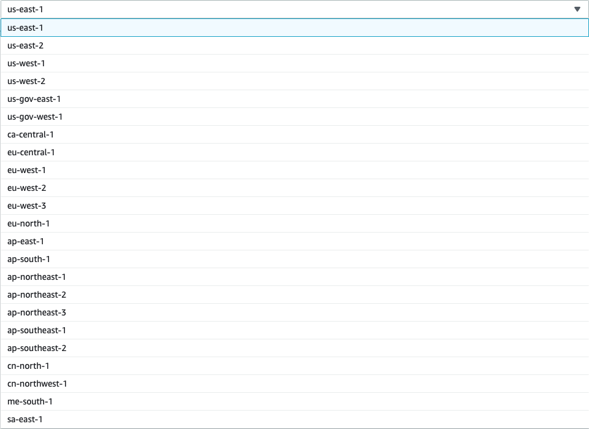
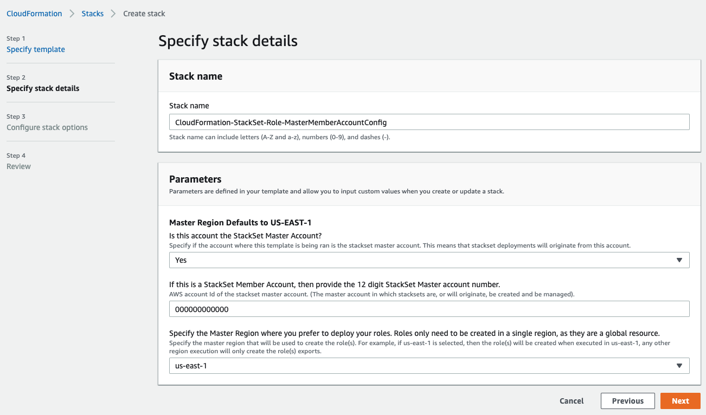
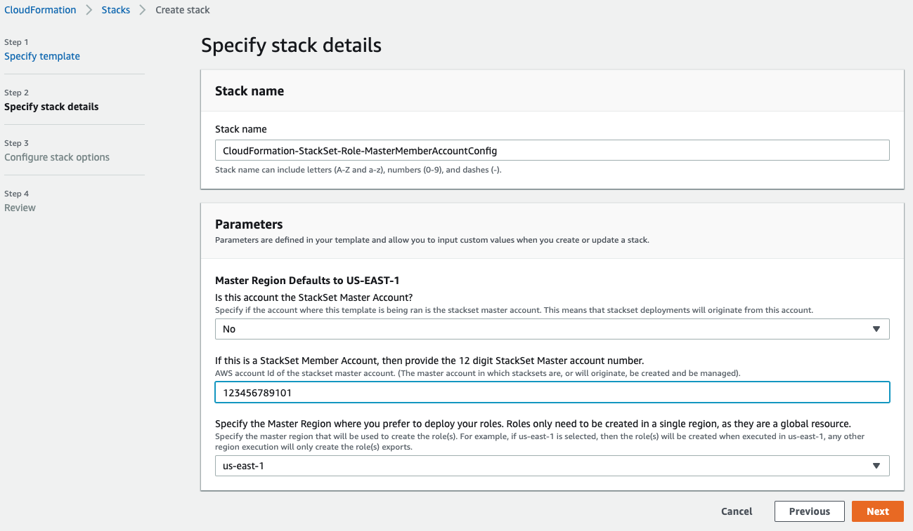

#   AWS CloudFormation StackSet Configuration & Roles

<br>  

## Description

Stacksets allow the ability to deploy a single AWS CloudFormation template into multiple accounts, or multiple regions within an account from a single template deployment within a centralized AWS *Master* account. The following CloudFormation template will create the 2 roles necessary to enable the ability to utilize stacksets. This same template can be deployed in both the master and any member accounts. Based on the values supplied for the included parameters, the template will create 1/2 roles. When the template is deployed, if the `StackSetMasterAccount` parameter is set to **Yes**, then the master stackset admin role will be created. The **master** role has a policy defined that allows the master role the permission to assume the member role in any account. If the `StackSetMasterAccount` parameter is set to **No**, then the stackset member role will be created in the account, which grants access only to the stackset master role, and will grant that role, administrator access within the account in order to allow the stackset master role, to deploy stacks within it.  

<br><br>

  

<br><br>  

## Pre-Requisite Templates

The Following Templates are Pre-Requisite Templates that are required for this template to run as they will include previously provisioned resource exports that will be consumed by this template.  

<br>  

| TemplateName:  | Required Export Name  | Required Exported Resources  |
|----------------|-----------------------|------------------------------|
| None           | N/A                   | N/A                          |  

<br><br>  

## Parameters

The template takes the following parameters at launch:  

<br>  

### DeployMasterRole

This parameter will be used by the template to determine which role will be created in the account. The *Master* role should only be created in the account where StackSets will be launched and manged from. This typically tends to be the main billing account.  

<br>  

  

<br>  

* If 'Yes' is chosen, then both the __AWSCloudFormationStackSetAdministrationRole__ role, and the and __AWSCloudFormationStackSetExecutionRole__ will be provisioned in the account.  
* If 'No' is chosen, then only the __AWSCloudFormationStackSetExecutionRole__ will be provisioned in the account.  

<br>  

### StackSetAdminAccountId

This parameter will take an input of a 12 digit account ID of the account in which the __AWSCloudFormationStackSetAdministrationRole__ role was created.  

* This parameter value will configure any member account in which this template is ran, to allow the __AWSCloudFormationStackSetAdministrationRole__ from the specified account to assume the __AWSCloudFormationStackSetExecutionRole__ that this template will create.

* This permission will allow the admin master account to launch Stacks into via CLoudFormation StackSets.  
* __*Example:*__ ```123456789101```  

<br>  
  
### MasterRegion

__Note: This parameter specifies the region where the roles/policies will be provisioned.__  

* If the value of the region set in the ${MasterRegion} matches the current execution region, then all IAM Global resources will be created, and the specified template outputs will be exported.
* If the value of the region set in the ${MasterRegion} does __NOT__ match the current execution region, then __NONE__ of the global IAM resources will not be created, however the values of the IAM global resources specified in the template outputs will still be exported.
* This limits role duplication, ensuring that if the template is ran in a StackSet, or manually across different regions in the same account, it is only created once, but the specified outputs are still exported to all regions where the stack has been deployed, allowing subsequent templates to universally use any output export as an !ImportValues reference.
* A template Mapping is used for the resource names to ensure consistency when exporting template output values even if the resources are not provisioned. Outputs are all manually constructed, to ensure that even if the exported resource was not provisioned, then the template does not fail due to the output export's linked resource not being provisioned.

<br>  

> __You must leave the role names as they are, CloudFormation is specifically looking for these specific role names.__  

<br>

  

<br><br>  

## Example Parameter Values

<br>  

  

<br><br>  

  

<br><br>  

## Resources

The template will create the following resources at launch (Only in the specified region that was set as the value for the ${MasterRegion} key located in the following Map *RoleMap:Metadata:MasterRegion*

<br>  

```yaml
Mappings:
  RoleMap:
    Roles:
      StackSetMasterRoleName: AWSCloudFormationStackSetAdministrationRole
      StackSetMemberExecutionRoleName: AWSCloudFormationStackSetExecutionRole
    MetaData:
      MasterRegion: us-east-1
```

<br>  

### AWSCloudFormationStackSetAdministrationRole

* CloudFormation StackSet Master Administration Role:
* This role should ONLY be created in the Master StackSet administrator account. __This is the account from which StackSets will be launched FROM.__  
* __This IAM role will ONLY be created in the region specified and referenced by the ${MasterRegion} template parameter__. As IAM roles are global, they only need to be created in a single region, but need to be consistent across all regions where the stack has been deployed.
* This role has a single inline policy defined that will allow this StackSet Master Admin role to assume the StackSet member execution role in any account where the member role has been provisioned.

<br>  

> __NOTE: This role MUST be named *AWSCloudFormationStackSetAdministrationRole* in order for it to be acknowledged and used by CloudFormation. The CloudFormation service expects to find that specific role name, enabling StackSet member account roles to be able to be assumed by the StackSet admin account role...__

<br>  

-----  

```yaml
  StackSetMasterRole:
    AssumeRolePolicyDocument:
      Version: "2012-10-17"
      Statement:
        - Effect: Allow
          Principal:
            Service: cloudformation.amazonaws.com
          Action:
            - sts:AssumeRole
    Policies:
        - PolicyName: 'AssumeStackSetMemberRole'
          PolicyDocument:
            Version: "2012-10-17"
            Statement:
              - Effect: Allow
                Action:
                  - sts:AssumeRole
                Resource:
                  - arn:aws:iam::*:role/AWSCloudFormationStackSetExecutionRole
```  

<br>  

### AWSCloudFormationStackSetExecutionRole

* CloudFormation StackSet Member Account Execution Role:
* This role should be created in __ALL__ accounts where StackSets will be deployed from the Master account. __This is any account of which StackSets will be launched INTO from the StackSet master administrator account.__  
* __This IAM role will ONLY be created in the region specified and referenced by the ${MasterRegion} template parameter__. As IAM roles are global, they only need to be created in a single region, but need to be consistent across all regions where the stack has been deployed.
* This role, once assumed by the StackSet master admin account role, will give that role Administrator Access via the member roles attached policy. This will allow the master admin role, via the assumed member role to launch any resources specified in StackSet templates that are launched via the StackSet master account role.  

<br>  

> __NOTE: This role MUST be named *AWSCloudFormationStackSetExecutionRole* in order for it to be acknowledged and used by CloudFormation. The CloudFormation service expects to find that specific role name, enabling the StackSet master admin account role to assume this provisioned member role...__

<br>  

-----  

```yaml
StackSetMemberExecutionRole:
  AssumeRolePolicyDocument:
    Version: "2012-10-17"
    Statement:
      - Effect: Allow
        Principal:
          AWS:
            - !Sub "arn:aws:iam::${StackSetMasterAccountId}:role/AWSCloudFormationStackSetAdministrationRole"
        Action:
          - sts:AssumeRole
  ManagedPolicyArns:
    - arn:aws:iam::aws:policy/AdministratorAccess
```  

<br><br>  

## Exports

The following exports will be created in __ALL__ Regions:

<br>  

| Output Logical ID:                      | Output:                                               | Output Value:                                                                                  | Export:                                                           |
|---------------------------------------- |------------------------------------------------------ |----------------------------------------------------------------------------------------------- |------------------------------------------------------------------ |
| CloudFormationStackSetMasterRoleName    | CloudFormation IAM StackSet Master Admin Role         | ```AWSCloudFormationStackSetAdministrationRole```                                              | AWS-CloudFormation-StackSet-Master-Administration-Role            |
| CloudFormationStackSetMasterRoleArn     | CloudFormation IAM StackSet Master Admin Role ARN     | ```arn:aws:iam::123456789101:role/AWSCloudFormationStackSetAdministrationRole```               | AWS-CloudFormation-StackSet-Master-Administration-Role-ARN        |
| CloudFormationStackSetMemberRoleName    | CloudFormation IAM StackSet Member Execution Role     | ```AWSCloudFormationStackSetExecutionRole```                                                   | AWS-CloudFormation-StackSet-Member-Role                           |
| CloudFormationStackSetMemberRoleArn     | CloudFormation IAM StackSet Member Execution Role ARN | ```arn:aws:iam::109876543210:role/AWSCloudFormationStackSetExecutionRole```                    | AWS-CloudFormation-StackSet-Member-Role-ARN                       |
